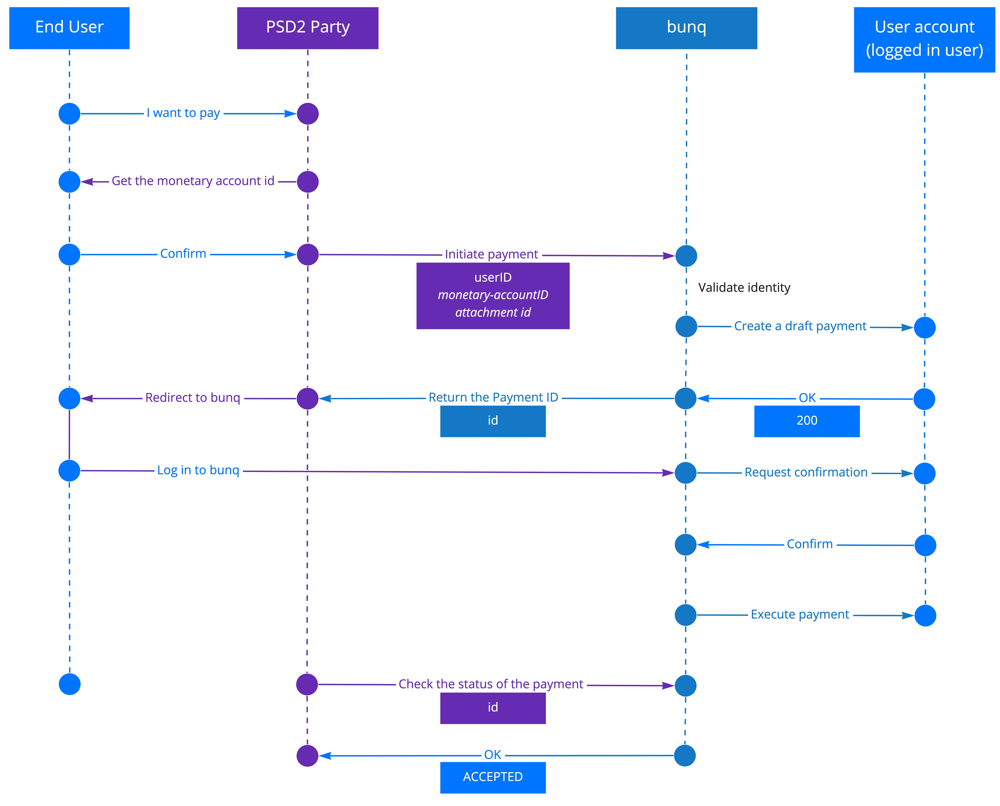

# PISP

As a PISP, you are allowed to authenticate in a user’s account with the following permissions:

1. read account information
   * legal name
   * IBAN
2. initiate payments \(create draft payments\)
3. confirm that the account balance is sufficient for covering the payment _\(will be available in upcoming releases\)_

Once a bunq user has confirmed they want to make a payment via your application, you can initiate the payment confirmation flow.

1. Open a session to the bunq server.
2. Get the id of the account you want to use to receive the money from the bunq users:
   * Call `GET v1/monetary-account`. Check the ids of the accounts and save the id of the account you want to transfer customer money to
3. Create a draft payment.
   * Call `POST v1/draft-payment` and pass the following parameters:
     1. _monetary-accountID_
     2. _userID_
     3. the customer’s email address, phone number or IBAN in the _counterparty\_alias_
4. If the user confirms their intent to make the payment, we carry out the transaction.
5. Check the status of the payment via `GET v1/draft-payment` using the draft payment `id` parameter returned in the previous step. 

